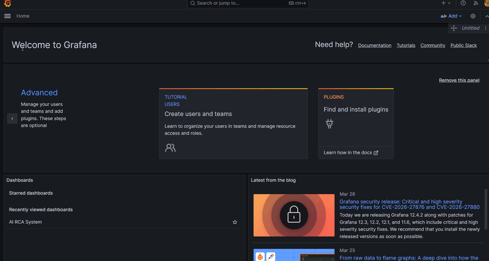
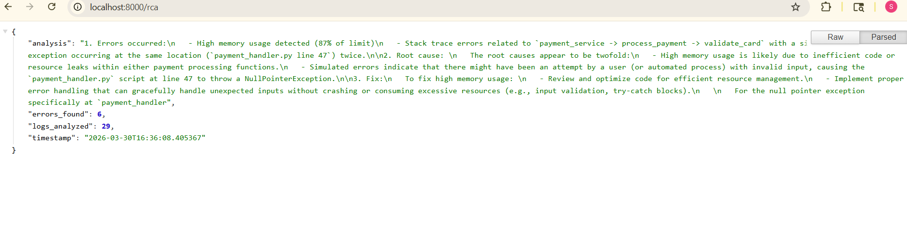
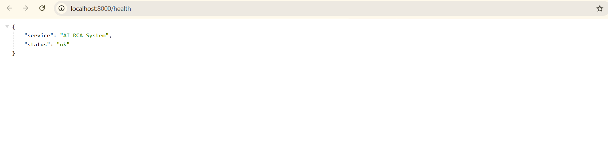
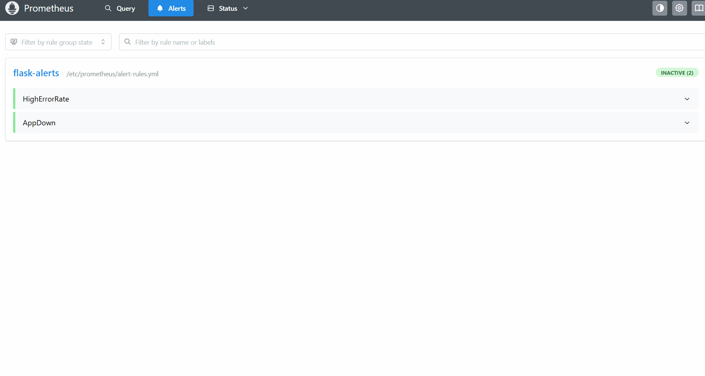

# 🔍 AI-Powered Root Cause Analysis System


> Automatically detects application errors and generates AI-driven root cause analysis — no manual log reading, no API keys, no data leaving your machine.

## 💡 Why I built this

On-call engineers waste hours manually grepping logs during incidents. I wanted to explore whether a local LLM could replace that entire workflow — ingest live logs, detect anomalies, and return a human-readable root cause + fix in seconds. This project is that proof of concept, built entirely with open-source tooling and zero cloud dependencies.

## 📸 Demo

### 🎬 Live Dashboard


### 🤖 AI Root Cause Analysis API


### ✅ Health Check


### 🔔 Prometheus Alerts


## 🧠 Sample RCA output
```json
{
  "root_cause": "ZeroDivisionError in /cause-error endpoint",
  "explanation": "The Flask route triggers division by zero, causing an unhandled 500 response.",
  "fix": "Add input validation — if divisor == 0, return a 400 before performing the division.",
  "confidence": "high"
}
```

## 🏗️ Architecture
```
Flask App ──► Promtail ──► Loki ──► RCA Service ──► Phi-4-mini (Ollama)
          ──► Prometheus ──► Grafana Dashboard        └──► REST API (/rca)
```

**Why this stack?**
- **Loki over ELK** — lightweight, Docker-friendly, no JVM overhead
- **Phi-4-mini via Ollama** — runs on a laptop GPU, zero data leakage, no API costs
- **Prometheus + Grafana** — industry-standard observability used by every major SRE team

## 🛠️ Tech Stack

| Layer | Technology |
|-------|------------|
| Application | Flask (Python) |
| Log Collection | Promtail → Loki |
| Metrics | Prometheus |
| Visualization | Grafana |
| AI/LLM | Microsoft Phi-4-mini via Ollama |
| Infrastructure | Docker Compose |

## ✨ Key Features

- **Automated RCA** — AI analyzes logs and returns root cause + fix in seconds
- **Local LLM** — Phi-4-mini runs on-device, no API keys, no data leakage
- **Real-time dashboards** — Live log streaming and error highlighting in Grafana
- **REST API** — Trigger analysis via `GET /rca`, integrate into any workflow

## 🚀 Quick Start

**Prerequisites:** Docker Desktop, [Ollama](https://ollama.ai) with Phi-4-mini
```bash
# Pull the model
ollama pull phi4-mini

# Clone and run
git clone https://github.com/vivek1251/ai-rca-system.git
cd ai-rca-system

# Configure environment
cp .env.example .env

# Start all services
docker compose up -d
```

## 🧪 Testing
```bash
# Simulate errors
curl http://localhost:5000/cause-error
curl http://localhost:5000/stress

# Get AI root cause analysis
curl http://localhost:8000/rca
```

## 📡 Endpoints

| URL | Purpose |
|-----|---------|
| `localhost:5000` | Flask demo app |
| `localhost:8000/rca` | AI root cause analysis |
| `localhost:8000/health` | Service health check |
| `localhost:9090` | Prometheus metrics |
| `localhost:3000` | Grafana (see .env for credentials) |

## 🧬 Running tests
```bash
pip install pytest pytest-cov
python -m pytest tests/ -v
```

## 🤝 Contributing

See [CONTRIBUTING.md](CONTRIBUTING.md) for ideas, extension points, and dev setup instructions.

## 📄 License

MIT